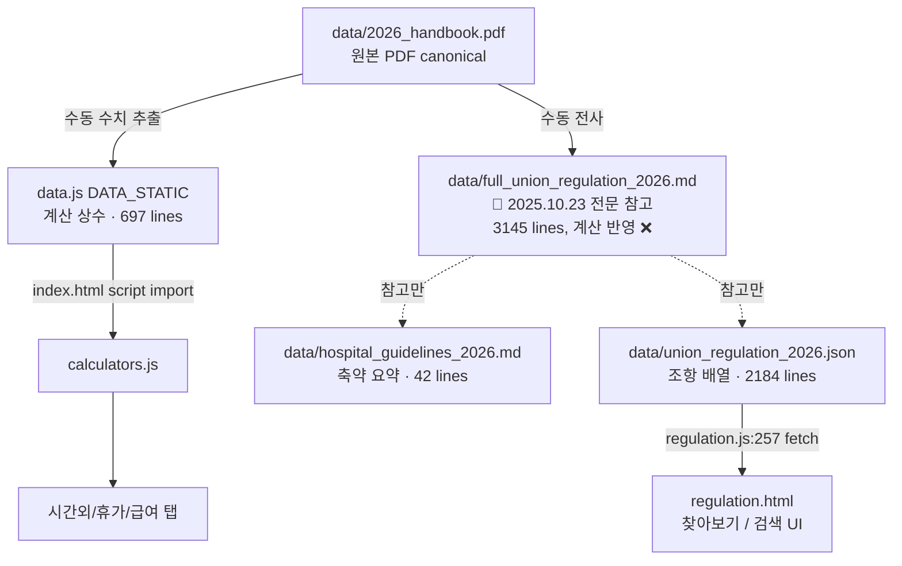
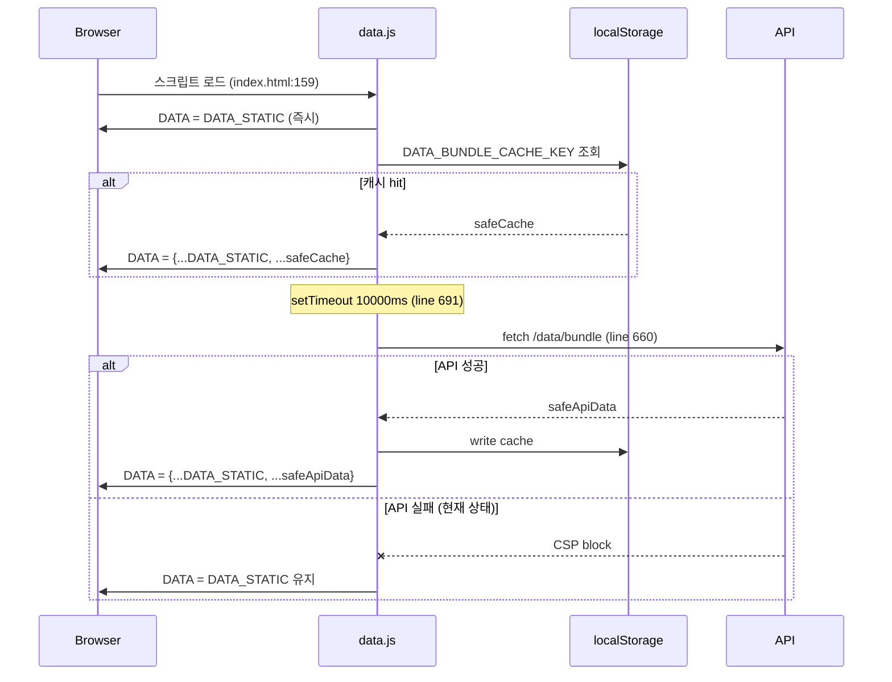

# Data Sources — SoT 인벤토리

> 작성일: 2026-04-23 (Plan D Task 2)
> 업데이트: 데이터 파일 추가/삭제 시 본 문서도 같이 수정.
> 목적: "어떤 데이터가 어디에 살고, 어떻게 로드되고, 어느 소비자가 읽는가" 를 한눈에.

## 1. 단협 규정 원본 (historical reference)

### `data/full_union_regulation_2026.md` 📖 **2025.10.23 단협 전문 (이전 버전 참고)**

- **역할:** 단협 전문 (full text). 원문 검색 / 개정 이력 추적 / 인용 참고용.
- **SoT 지위:** **이전 버전 참고 자료** — 런타임 계산에 **직접 반영되지 않음**.
- **관리:** 사용자가 직접 유지보수. 다음 단협 갱신 시 `data/full_union_regulation_YYYY.md` 신규 추가, 본 파일은 과거 버전으로 보존.
- **런타임 로드:** **안 함** (사람이 읽는 참고 문서).
- **실제 계산 SoT:** `data.js DATA_STATIC` 이 독립된 숫자 원본. 본 문서와의 정합성은 `data/calc-registry.json` + Vitest 가 간접 검증 + 사람이 주기적으로 `docs/architecture/known-issues.md` 의 드리프트 기록 확인.
- **현재 파일 상태:** 3,145 lines, 95 조항, 364 개 `<YYYY.MM>` 합의 주석. handbook PDF (p.5~104) 전수 전사본 (2026-04-24).

### `data/hospital_guidelines_2026.md`

- **역할:** full_union 의 **축약본** — regulation.html 표시 참고 / 개발자용 요약.
- **로드:** **런타임 미사용** (`.js`/`.html` grep 결과 0건 확인).
- **갱신 관계:** full_union 변경 시 사람이 여기도 수동 갱신.
- **현재 크기:** 8,965 bytes / 42 lines

### `data/union_regulation_2026.json`

- **역할:** 단협 조항의 구조화된 JSON (chapter/title/content/clauses 배열).
- **로드:** `regulation.js:257` — `function tryLoadBrowseFromJson()` 에서 `fetch('data/union_regulation_2026.json')` 으로 로드.
  ```
  regulation.js:235:  // 정적 JSON(union_regulation_2026.json)이 찾아보기의 표준 데이터 소스.
  regulation.js:257:  var url = 'data/union_regulation_2026.json';
  regulation.js:259:  return fetch(url)
  ```
- **소비자:** `regulation.js` → `DATA.handbook` 에 주입 → `regulation.html` (찾아보기/검색 UI).
  ```
  data.js:557:  // 초기에는 빈 배열. regulation.js에서 union_regulation_2026.json 로드 후 동적으로 채워짐.
  ```
- **계산 영향:** 없음 (텍스트만).
- **갱신 관계:** full_union 변경 시 사람이 조항을 JSON 구조로 변환해 반영.
- **현재 크기:** 101,072 bytes / 2,184 lines

## 2. 런타임 계산 데이터

### `data.js` (DATA_STATIC)

- **역할:** 모든 급여/수당/휴가 계산의 SoT. 하드코드된 JS 상수.
- **로드 방식:** `index.html:159` — `<script src="data.js?v=2.8" defer>` 로 직접 import.
- **Top-level 키 목록** (grep `^  [a-z][a-zA-Z]*:` — data.js 실제 결과):
  ```
  jobTypes        (line 9)
  payTables       (line 23)
  allowances      (line 144)
  longServicePay  (line 177)
  familyAllowance (line 188)
  seniorityRates  (line 198)
  annualLeave     (line 207)
  leaveQuotas     (line 216)
  ceremonies      (line 323)
  leaveOfAbsence  (line 338)
  severancePay    (line 353)
  shiftSchedule   (line 362)
  medicalDiscount (line 369)
  refreshCategories (line 376)
  deductions      (line 382)
  faq             (line 391)
  contacts        (line 468)
  handbookTopics  (line 480)
  handbook        (line 559)  — 초기 빈 배열, regulation.js가 런타임 채움
  unionStepEvents (line 585)
  familySupportMonths (line 596)
  recoveryDay     (line 599)
  ```
- **갱신 관계:** full_union 의 수치(시간외 150%, 가족수당 등)를 사람이 추출해 여기 반영.
- **현재 줄 수:** 697 lines

### `data/user_profile.json`

- **역할:** 스키마/예시 템플릿 (버전 1.0).
- **로드:** **런타임 미사용** (`.js`/`.html` grep 결과 0건 확인).
- **실사용자 프로필 저장소:** `localStorage['snuhmate_hr_profile_<uid>']` (data.js 의 DATA 아님).
- **현재 크기:** 1,586 bytes / 62 lines

### API `http://localhost:3001/api/data/bundle`

- **역할:** 월간 업데이트용 원격 데이터 번들 (백엔드 기반 DATA 갱신).
- **호출:** `data.js:660` — `loadDataFromAPI()` 함수 내 `fetch(_apiBase + '/data/bundle')`.
  ```
  data.js:610:  const DATA_BUNDLE_CACHE_KEY = 'data_bundle_cache_2026-04';
  data.js:634:  async function loadDataFromAPI() {
  data.js:638:    const cached = readStorageJSON(DATA_BUNDLE_CACHE_KEY);
  data.js:660:    const res = await fetch(_apiBase + '/data/bundle');
  data.js:691:  setTimeout(loadDataFromAPI, 10000);
  ```
- **상태:** 백엔드 미배포 → CSP 차단 에러 2건/페이지로드 발생.
- **갱신 경로:** 배포 시 DATA_STATIC 과 병합해 localStorage 캐시(`data_bundle_cache_2026-04`).

## 3. 정적 자료 (계산 무관)

- `data/2026_handbook.pdf` — 규정 PDF 뷰어용.
- `data/백엔드 아키텍처 업그레이드 계획.md` — 내부 계획 문서 (334 lines, 14,599 bytes).
- `archive/excel-parser/` — 과거 이관된 독립 프로젝트.
- `archive/nurse-rostering-builder/` — 과거 이관된 독립 프로젝트.

## 4. SoT 계층 + 갱신 흐름



## 5. 런타임 로드 플로우



## 6. 결론

- **단협 전문 (참고 자료)**: `data/full_union_regulation_2026.md` — 3,145 lines, 95조, 364 합의. **계산 반영 안 함** — 원문 검색/개정 추적용.
- **계산 SoT**: `data.js DATA_STATIC` (697 lines). 단협 개정 시 사용자가 수치를 수동 추출해 갱신.
- **canonical 원본**: `data/2026_handbook.pdf` (PDF). full_union.md 는 여기서 수동 전사된 사본.
- **파생 SoT 3종**: hospital_guidelines (축약 · 런타임 미사용), union_regulation.json (브라우저 찾아보기), DATA_STATIC (계산).
- **연결 메커니즘**: **없음** — full_union 변경 시 3곳 모두 사람이 수동 동기화.
- **런타임 미사용 파일**: `full_union_regulation_2026.md` (런타임 로드 안 함, 사람 읽는 마스터 문서), `hospital_guidelines_2026.md` (grep 0건), `user_profile.json` (grep 0건) — 모두 사람 관리 문서.
