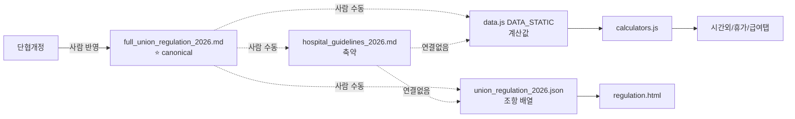

# Source of Truth — 드리프트 리스크 분석

> 작성일: 2026-04-23 (Plan D Task 5)
> 단협 개정 / 데이터 업데이트 시 "어느 곳이 자동 반영 안 되는가" 의 지도.
> Task 3 (calc-registry) + Task 4 (integration-points) 의 발견을 실증 사례로 포함.

## 1. 현재 구조 요약



**문제:** canonical full_union 변경 시 3개 파생 파일이 자동 반영되지 않음. 점선 연결은 전부 사람 의존.

### 조항 참조 비대칭 (Step 1 증거)

| 파일 | 제X조 언급 수 |
|------|-------------|
| data.js | 19개 고유 조항 (73건 언급) |
| hospital_guidelines_2026.md | 21개 고유 조항 (23건 언급) |

- **data.js 에만 있는 조항** (md에 없음): 제7조, 제30조, 제47조, 제49조, 제50조, 제62조, 제63조, 제65조, 제67조, 제71조 (10개)
- **md에만 있는 조항** (data.js에 없음): 제24조, 제26조, 제28조, 제33조, 제35조, 제39조, 제41조, 제43조, 제52조, 제58조, 제59조, 제63조의2 (12개)

두 파일의 조항 참조가 22개 중 22개 불일치 항목을 포함 — 자동 정합성 검증 메커니즘이 없음을 직접 증명.

### git 이력 요약

| 파일 | 최근 수정 커밋 |
|------|-------------|
| data.js | 99f1cc0 (feat: Playwright e2e 스모크 + Vitest 인프라) |
| hospital_guidelines_2026.md | 79eed94 (chore: save work-in-progress before QA session) |

두 파일이 독립적으로 수정됨. 단협 반영 시 한 쪽만 업데이트될 리스크 구조적으로 존재.

## 2. 드리프트 위험 매트릭스

| 항목 | 변경 빈도 | 현재 SoT | 자동 반영? | 리스크 레벨 |
|------|----------|---------|----------|------------|
| 보수표 (payTables.basePay/abilityPay/bonus) | 연 1회 (단협 갱신) | data.js DATA_STATIC | ❌ 수동 | **High** |
| 시간외 할증률 (overtimeRates) | 드물다 (법/단협) | data.js DATA_STATIC | ❌ | **Medium** |
| 가족수당 단가 (familyAllowance) | 2~3년 | data.js DATA_STATIC | ❌ | Medium |
| 연차 한도 (25일) | 법정 고정 | data.js DATA_STATIC | ❌ | Low |
| 온콜/야간가산 (allowances) | 부속합의 | data.js DATA_STATIC | ❌ | Medium |
| 장기근속수당 구간 (longServicePay) | 단협 | data.js DATA_STATIC | ❌ | Medium |
| 퇴직수당 구간 (severancePay) | 동결 (과거 기준) | data.js DATA_STATIC | ❌ | Low |
| 리커버리 데이 누적 트리거 | 부속합의 | data.js DATA_STATIC.recoveryDay | ❌ | **High (Bug #4 참조)** |
| 장기재직 휴가 (longServiceLeave) | 단협 | data.js FAQ vs md 제42조 | ❌ | **High (Bug #5 참조)** |

## 3. 실증 드리프트 사례 (Task 3/4 발견)

### Case 1: 미존재 함수 호출

- **`CALC.calcRetirement`** — app.js:1347 에서 호출하나 calculators.js 에 정의 없음.
- try/catch 로 silent fail. 퇴직금 계산 결과 누락 가능.
- 함수가 언제 삭제됐는지 추적 불가 (호출부와 정의부가 독립 수정됨).

### Case 2: 네임스페이스 오류 → silent default

- **`CALC.calcServiceYears`** — salary-parser.js:1352 에서 호출.
- 실제 정의는 `PROFILE.calcServiceYears` (profile.js:129). 네임스페이스 오류.
- 삼항 폴백으로 `serviceYears = 0` 으로 고정됨. 파서가 근속연수를 항상 0으로 반환.

### Case 3: 내부 상수 하드코딩 (드리프트 소스)

- **`calcNursePay`** (calculators.js:758) — `DATA.allowances.preceptorPay` (200,000원) 가 data.js 에 정의되어 있음에도 함수 내부에 동일 값 상수 하드코딩.
- DATA 값 변경해도 함수는 독립적으로 바뀌지 않아 수당 부속합의 개정 시 두 곳을 각각 수정해야 함.

### Case 4: 부분 구현으로 인한 드리프트

- **`recoveryDay.otherCumulativeTrigger`** (시설/이송/미화 20회 기준) data.js 에 정의.
- `calcNightShiftBonus` 는 `nurseCumulativeTrigger` (15회) 만 참조, `otherCumulativeTrigger` 미사용.
- 시설직 리커버리 데이 20회 트리거 계산이 전혀 동작하지 않음.

### Case 5: md ↔ code 값 불일치

- **장기재직 휴가**: hospital_guidelines_2026.md 제42조 "20년 이상 **7일**" vs data.js FAQ "20년 이상 **10일**".
- 두 값 중 하나는 오래된 기준. 사용자가 어느 쪽 화면을 보느냐에 따라 다른 정보를 받음.
- 자동 교차 검증 없음.

### Case 6: 이벤트-상태 반영 단절

- **`applyProfileToOvertime` 가 `profileChanged` 이벤트 미수신**.
- 프로필 저장 후 시간외 탭을 열어두더라도 시급 즉시 갱신 안 됨. 탭 재진입 필요.
- 사용자 관점에서 "프로필 저장이 연동 안 됨" 으로 인지.

### Case 7: 이벤트 수신자 희소

- **`profileChanged` 수신자 단 1곳** (pay-estimation.js:873).
- 홈 탭, 설정 탭 등 프로필에 의존하는 나머지 탭은 이벤트를 수신하지 않아 프로필 변경 즉시 반영 불가.

### Case 8: localStorage 키 일관성

- **`leaveRecords` 키** — leave.js:9 에서 `getUserStorageKey()` 미적용, 고정 문자열 사용.
- 주석에 의도적 설계로 명시되어 있으나 멀티 유저 환경(같은 기기 공유)에서 데이터 섞임 위험.
- 다른 탭의 키 관리 패턴과 불일치 — 의도된 트레이드오프이나 문서화 필요.

## 4. md ↔ data.js 조항 참조 대조

Step 1 comm 결과 (2026-04-23 기준):

### data.js 에만 있는 조항 (md에 없음)
`제7조, 제30조, 제47조, 제49조, 제50조, 제62조, 제63조, 제65조, 제67조, 제71조`

이 10개 조항은 data.js 코드 주석에서 근거로 언급되나 hospital_guidelines_2026.md 에 대응 조문 없음.
- 가능성 1: hospital_guidelines 가 축약본이라 해당 조항 미수록.
- 가능성 2: data.js 주석이 full_union 직접 참조, md 와 독립 작성됨.
- 어느 쪽이든 **md만 보고 data.js 값이 맞는지 검증 불가**.

### md에만 있는 조항 (data.js에 없음)
`제24조, 제26조, 제28조, 제33조, 제35조, 제39조, 제41조, 제43조, 제52조, 제58조, 제59조, 제63조의2`

이 12개 조항은 md에 기재된 규정이나 data.js 어디에도 대응 상수/계산이 없음.
- 가능성 1: 해당 조항이 계산 로직에 영향을 주지 않음 (서술 조항).
- 가능성 2: 구현 누락.
- **자동 비교 도구 없음** — 사람이 하나씩 확인해야 함 (Plan E 후보).

## 5. 권장 개선안 (우선순위별)

### Tier 1 — 즉시 가능 (Plan E 후보)

**1. Calculator Registry 자동 검증 테스트**

- `docs/architecture/calc-registry.json` (머신 리더블) 생성.
- Vitest 부팅 시 JSON 읽어 `DATA.<path> === expectedValue` 전수 assert.
- 단협 개정 → JSON 업데이트 → 테스트 맞춰 업데이트 → DATA 갱신 순서. 세 곳 중 하나라도 빠지면 빨간불.

```javascript
// 예시
describe('calc-registry drift check', () => {
  const registry = require('../../docs/architecture/calc-registry.json');
  registry.assertions.forEach(({ path, expected, article }) => {
    it(`${article} → DATA.${path} === ${expected}`, () => {
      expect(getPath(DATA, path)).toBe(expected);
    });
  });
});
```

**2. calcNursePay 하드코딩 제거 (Case 3)**

- `DATA.allowances.preceptorPay` 참조로 교체. 1줄 수정, 드리프트 소스 제거.

### Tier 2 — 중간 (Plan F/G 후보)

**3. DATA_STATIC → `data/pay_rules_2026.json` 분리**

- 하드코드 JS 객체를 순수 JSON 으로 이관.
- data.js 는 fetch 또는 require 로 로드.
- md ↔ JSON 에 동일한 "조항 ID" (`§34_overtime_rate` 등) 메타데이터 부여해 linkable.

**4. 단협 파서 (정규식 기반)**

- union_regulation_2026.json 조항 텍스트에서 숫자 + 단위 추출.
- DATA 와 대조. 예: 제34조에서 "150%" 언급 → `DATA.overtimeRates.extended === 1.5` 일치 확인.

**5. profileChanged 수신자 확장 (Case 6/7)**

- 홈 탭, 설정 탭, 시간외 탭에서 `profileChanged` 구독 추가.
- `applyProfileToOvertime` 을 이벤트 핸들러로 등록.

### Tier 3 — 장기 (별도 프로젝트)

**6. 버전드 SoT + 효력 발생일**

- `data/pay_rules_2023.json`, `data/pay_rules_2025.json`, `data/pay_rules_2026.json` 처럼 연도별 버전.
- 퇴직금 시뮬 같은 과거 기준 계산 시 해당 연도 룰 참조.

**7. CALC 함수 존재 검증 테스트**

- 모든 `CALC.*` 호출부를 정적 분석 또는 테스트로 순회, 정의 없는 경우 빌드 실패.
- Case 1 (calcRetirement) / Case 2 (calcServiceYears 네임스페이스) 재발 방지.

## 6. 후속 플랜 제안

Plan D 완료 후 아래 순서 권장:

1. **Plan E: Calculator Registry 검증 + SoT JSON 분리** (Tier 1 + 2-3) — 최우선. 단협 개정 시 드리프트 자동 감지. 1~2일 작업, 이후 매 개정마다 빨간불/초록불로 상태 파악.
2. **Plan F: 확실한 latent 버그 픽스** — Case 1~5 (calcRetirement 미존재, calcServiceYears 네임스페이스, calcNursePay 하드코딩, recoveryDay 부분 구현, 장기재직 휴가 값 불일치).
3. **Plan G: 통합 e2e 테스트 + 이벤트 수신자 보강** — Case 6~7 (profileChanged 수신 범위 확장, 탭간 프로필 동기화).
4. **Plan H: standalone 페이지 검증** — retirement.html, regulation.html, 급여 예상/수당 카드 독립 스모크.

각 플랜은 독립 실행 가능. Plan E 가 **가장 투자 대비 효과 큼**.

## 7. 결론

- **현재 SoT 아키텍처**: `data.js` 하드코드 + 별개의 규정 텍스트 두 파일. 연결 메커니즘 0.
- **정합성 보증**: 0. 사람이 기억해서 여러 곳 동기화해야 함.
- **조항 참조 불일치**: data.js 10개 조항이 md에 없고, md 12개 조항이 data.js에 없음.
- **실증 드리프트 8건** (Task 3/4 에서 발견) — 이미 프로덕션 코드에 존재하는 버그.
- **즉시 개선 가능**: Calculator Registry 검증 테스트 (Plan E Tier 1) — 1~2일 작업, 이후 단협 개정 때마다 빨간불/초록불로 상태 파악.
