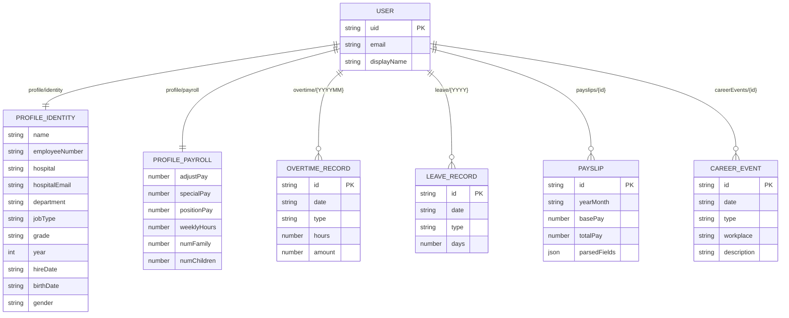

# SNUHmate 데이터베이스 스키마 & 흐름도

> 최종 업데이트: 2026-05-04  
> 진실 원천: `apps/web/src/firebase/key-registry.js`

---

## 1. 저장소 레이어 구조

```
┌─────────────────────────────────────────────────────────────────┐
│                        브라우저 (Client)                         │
│                                                                  │
│   onboarding.js                   /app 탭들 (profile, payroll…)  │
│        │                                    │                    │
│        ▼                                    ▼                    │
│   localStorage (guest 키)       localStorage (uid or guest 키)   │
│        │                                    │                    │
│        └──────────────── ▼ ─────────────────┘                   │
│                     PROFILE.save()                               │
│                     auto-sync.js (write-through)                 │
│                          │                                       │
└──────────────────────────┼──────────────────────────────────────┘
                           │ (로그인 시만)
                           ▼
              ┌─────────────────────────┐
              │       Firestore         │
              │   users/{uid}/…         │
              └─────────────────────────┘
```

---

## 2. localStorage 키 목록 (Key Registry)

### 2-A. 키 명명 규칙

| 상태 | 패턴 | 예시 |
|------|------|------|
| 게스트 | `{baseKey}_guest` | `snuhmate_hr_profile_guest` |
| 로그인 | `{baseKey}_uid_{uid}` | `snuhmate_hr_profile_uid_abc123` |
| 공용(기기) | `{baseKey}` | `snuhmate_settings` |
| 기기전용 | `{baseKey}` | `snuhmate_local_uid` |

### 2-B. 전체 키 인벤토리

| baseKey | scope | localScope | Firestore shape | 카테고리 |
|---------|-------|------------|-----------------|---------|
| `snuhmate_hr_profile` | sync | user | `split-identity-payroll` | identity |
| `snuhmate_work_history` | sync | user | `collection-by-id` | workHistory |
| `snuhmate_work_history_seeded` | sync | user | `doc-merge` | workHistory |
| `snuhmate_career_events` | sync | user | `collection-by-id` | workHistory |
| `overtimeRecords` | sync | user | `collection-by-yyyymm` | overtime |
| `otManualHourly` | sync | user | `doc-merge` | payroll |
| `overtimePayslipData` | sync | user | `collection-by-id` | payroll |
| `leaveRecords` | sync | user | `collection-by-yyyy` | leave |
| `snuhmate_schedule_records` | sync | shared | `collection-by-yyyymm` | schedule |
| `snuhmate_settings` | sync | shared | `doc` | settings |
| `theme` | sync | shared | `doc-merge` | settings |
| `snuhmate_reg_favorites` | sync | user | `doc` | reference |
| `snuhmate_local_uid` | device-local | — | — | — |
| `snuhmate_anon_id` | device-local | — | — | — |
| `snuhmate_device_id` | device-local | — | — | — |

---

## 3. 프로필 스키마 (snuhmate_hr_profile)

localStorage 에는 합쳐진 shape 하나로 저장.  
Firestore 에는 identity / payroll 두 doc 으로 분리 저장 (암호화).

### 3-A. Identity 필드 → `users/{uid}/profile/identity`

| 필드 | 타입 | 설명 |
|------|------|------|
| `name` | string | 이름 (별칭) |
| `employeeNumber` | string | 사번 |
| `hospital` | string | 소속 병원 |
| `hospitalEmail` | string | 사번@병원도메인 (자동 생성) |
| `department` | string | 부서 |
| `jobType` | string | 직종 |
| `grade` | string | 직급·등급 (예: J1, J3) |
| `year` | number | 호봉(연차) |
| `hireDate` | string | 입사일 (YYYY-MM-DD) |
| `birthDate` | string | 생년월일 (YYYY-MM-DD) |
| `gender` | string | 성별 (M/F/'') |
| `hasMilitary` | boolean | 군복무 여부 |
| `militaryMonths` | number | 군복무 기간(개월) |
| `hasSeniority` | boolean | 근속가산기본급 적용 여부 |
| `workHistorySeeded` | boolean | 자동 시드 완료 플래그 |
| `lastEditAt` | number | 마지막 수정 타임스탬프 (**평문** — 인덱싱용) |

### 3-B. Payroll 필드 → `users/{uid}/profile/payroll`

| 필드 | 타입 | 설명 |
|------|------|------|
| `adjustPay` | number | 조정급 |
| `upgradeAdjustPay` | number | 승진 조정급 |
| `numFamily` | number | 가족 수 |
| `numChildren` | number | 자녀 수 |
| `childrenUnder6Pay` | number | 6세이하 자녀수당 월액 |
| `specialPay` | number | 특수직 수당 |
| `positionPay` | number | 보직 수당 |
| `workSupportPay` | number | 업무지원비 |
| `weeklyHours` | number | 월 소정근로시간 (기본 209) |
| `unionStepAdjust` | string | 노조협의 호봉 보정 |
| `manualHourly` | number | 수동 시급 입력 |

### 3-C. 병원 이메일 도메인 매핑

| 병원 | 이메일 도메인 | 예시 |
|------|-------------|------|
| 서울대학교병원 (본원) | `snuh.org` | `20320@snuh.org` |
| 어린이병원 | `snuh.org` | `20320@snuh.org` |
| 강남센터 | `snuh.org` | `20320@snuh.org` |
| 보라매병원 | `brmh.org` | `20320@brmh.org` |
| 국립교통재활병원 | `ntrh.or.kr` | `20320@ntrh.or.kr` |

---

## 4. Firestore 컬렉션 구조

```
users/
  {uid}/
    profile/
      identity          ← 이름·사번·병원·hospitalEmail·직종·호봉 (AES-GCM 암호화)
      payroll           ← 조정급·수당 정책 (AES-GCM 암호화)
    overtime/
      {YYYYMM}          ← { entries: [...] }  해당 월 시간외 기록
    leave/
      {YYYY}            ← { entries: [...] }  해당 연도 휴가 기록
    payslips/
      {docId}           ← 급여명세서 파싱 결과 (암호화)
    schedule/
      {YYYYMM}          ← 해당 월 근무표 기록
    careerEvents/
      {eventId}         ← 커리어 이벤트 (입사·승급·표창 등)
    work_history/
      {entryId}         ← 근무이력 항목 (legacy — careerEvents 로 통합 예정)
    settings/
      app               ← 앱 설정·테마
      reference         ← 규정 즐겨찾기
```

---

## 5. 데이터 흐름도

### 5-A. 온보딩 → 앱 진입

```
snuhmate.com/

  [카드 8: 개인정보 입력]
  병원 select + 사번 입력
        │
        │  buildHospitalEmail(사번, 병원) → 예: "20320@brmh.org"
        ▼
  localStorage['snuhmate_hr_profile_guest'] = {
    name, employeeNumber, hospital, hospitalEmail,
    department, jobType, hireDate, birthDate, gender
  }
  localStorage['snuhmate_onboarding_pending'] = '1'
        │
        ▼
  [카드 9: 시작 방식]
        │
        ├─ 게스트 ──────────────────────────────► /app (guest 키 사용)
        │
        └─ 이메일/Google 로그인 성공
                  │
                  ▼
           applyOnboardingProfile(uid)
           guest 키 → uid 키로 승급
           writeProfile(uid, profile) → Firestore
                  │
                  ▼
                /app
```

### 5-B. 로그인 후 데이터 동기화

```
Firebase onAuthChanged(user)
        │
        ├─ user = null (비로그인)
        │     sync-lifecycle.logout(null)
        │     → guest 데이터 보존 (uid=null이면 guest 정리 스킵)
        │
        └─ user (emailVerified = true)
              │
              ├─ sync-lifecycle.login(uid)
              │   → googleSub·email·displayName → snuhmate_settings
              │
              ├─ hydrate(uid)
              │   Firestore → localStorage pull (LWW 비교)
              │   profile/identity, profile/payroll
              │   overtime/{YYYYMM}, leave/{YYYY}
              │   payslips/{id}, careerEvents/{id}
              │
              ├─ (마이그레이션 다이얼로그)
              │   guest 키 데이터 → Firestore 업로드 여부 선택
              │
              └─ emitDomainRefresh()
                  → 모든 탭 UI 갱신
```

### 5-C. 프로필 저장 write-through

```
/app info 탭 → 저장하기 클릭
        │
        ▼
PROFILE.collectFromForm(PROFILE_FIELDS)
→ { name, employeeNumber, hospital, hospitalEmail, … }
        │
        ▼
PROFILE.save(data)
→ localStorage[STORAGE_KEY] = JSON.stringify(merged)
→ recordLocalEdit('snuhmate_hr_profile')
→ dispatchEvent('profileChanged')
        │
        │  (로그인 상태일 때만)
        ▼
profile-sync.js → writeProfile(uid, profile)
        │
        ├─ _splitFields(profile)
        │   identity: { name, employeeNumber, hospital, hospitalEmail,
        │               department, jobType, grade, year, hireDate, … }
        │   payroll:  { adjustPay, specialPay, weeklyHours, … }
        │
        ├─ encryptDoc(identity, key) → AES-GCM cipher
        ├─ encryptDoc(payroll, key)  → AES-GCM cipher
        │
        └─ Firestore setDoc(users/{uid}/profile/identity, encrypted, merge:true)
           Firestore setDoc(users/{uid}/profile/payroll,   encrypted, merge:true)
```

### 5-D. 로그아웃

```
로그아웃 버튼 클릭
        │
        ▼
sync-lifecycle.logout(uid)
        │
        ├─ clearActiveUserLocalData(uid)
        │   removes: snuhmate_hr_profile_uid_{uid}
        │            overtimeRecords_uid_{uid}
        │            leaveRecords_uid_{uid}
        │            payslip_{uid}_*
        │            snuhmate_career_events_uid_{uid}  … (KEY_REGISTRY user-scope 전체)
        │
        ├─ clearAllGuestData()      ← _guest 키 전체 정리
        │
        ├─ clearAuthBridge()        ← googleSub, googleEmail, displayName 삭제
        │
        └─ emitDomainRefresh({ reason: 'logout' })
           dispatchEvent('app:auth-data-reset')
           → 모든 탭 빈 상태로 재렌더
```

---

## 6. 암호화 정책

| 항목 | 내용 |
|------|------|
| 알고리즘 | AES-GCM 256-bit (Web Crypto API) |
| 키 파생 | `HKDF(SHA-256, uid_bytes, salt)` → 256-bit 키 |
| 암호화 범위 | identity 전 필드, payroll 전 필드, 급여명세서 민감 필드 |
| 평문 저장 | `lastEditAt` (타임스탬프 인덱싱용)만 평문 |
| 서버 접근 | Firebase 서버는 암호화된 blob만 보관 — 복호화 불가 |
| 키 보관 | 브라우저 메모리 + uid 파생 (서버 저장 없음) |

---

## 7. 이벤트 버스

| 이벤트명 | 발행 시점 | 주요 구독자 |
|---------|---------|-----------|
| `profileChanged` | PROFILE.save() | profile-tab, overtime-tab, retirement |
| `payslipChanged` | 급여명세서 추가/수정 | retirement auto-recompute |
| `overtimeChanged` | 시간외 기록 변경 | home summary, overtime-tab |
| `leaveChanged` | 휴가 기록 변경 | leave-tab, home summary |
| `careerEventsChanged` | 커리어 이벤트 변경 | work-history timeline 재렌더 |
| `app:cloud-hydrated` | Firestore hydrate 완료 | 모든 탭 데이터 갱신 |
| `app:sync-login` | 로그인 성공 | auto-sync write-through 시작 |
| `app:auth-data-reset` | 로그아웃 완료 | UI 초기화, guest 모드 복원 |

---

## 8. 스키마 ERD (Mermaid)


