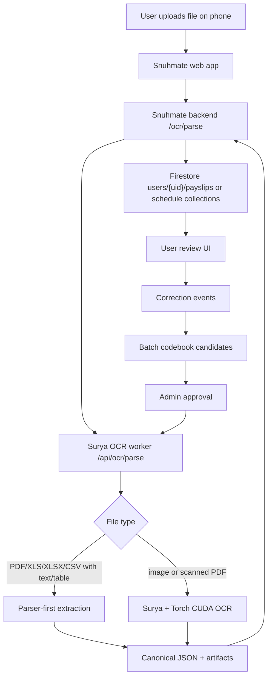

# Surya OCR Integration

## Runtime Flow

## Current Decision

The OCR implementation lives with the Snuhmate monorepo, but the GPU runtime is isolated under `services/surya-ocr`.

This gives one repository for API contracts, admin UI, and tests, while keeping Surya + Torch CUDA out of the normal backend deployment.

## Backend Contract

The existing FastAPI backend exposes:

- `GET /ocr/health`
- `POST /ocr/parse`

Set `SNUHMATE_OCR_SERVICE_URL` to point the backend at the GPU worker. The local default is `http://127.0.0.1:8030`.

## Web Contract

The web app uses `apps/web/src/client/ocr-api.js`.

- Payroll uploads call server OCR first from `SALARY_PARSER.parseFile()`, then fall back to the existing browser parser.
- Work schedule uploads call server OCR first from `parseScheduleFile()`, then fall back to the existing Excel/CSV/Vision path.
- Local dev probes `http://127.0.0.1:8051`, `http://localhost:8001`, and `http://127.0.0.1:8001`.
- Production should set `PUBLIC_SNUHMATE_BACKEND_URL` or `PUBLIC_SNUHMATE_OCR_BACKEND_URL`.

## Worker Contract

The worker exposes:

- `GET /health`
- `POST /api/ocr/parse`

The worker accepts `doc_type=auto|payroll|work_schedule`.

## Quality Rule

Structured files should bypass Surya. OCR should be reserved for phone images and scanned PDFs. Corrections must be stored separately from the canonical statement/schedule so repeated user fixes can become codebook candidates after admin approval.
