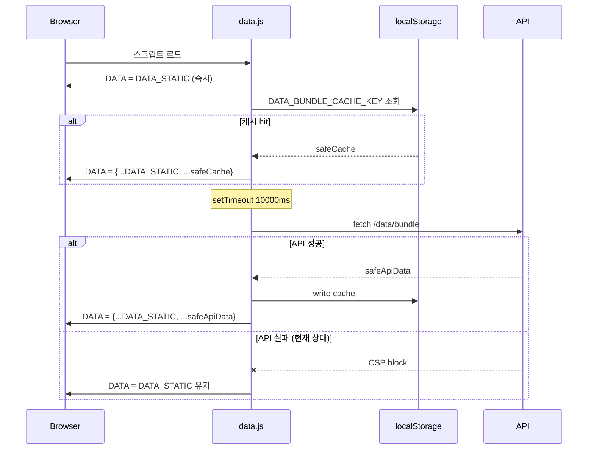
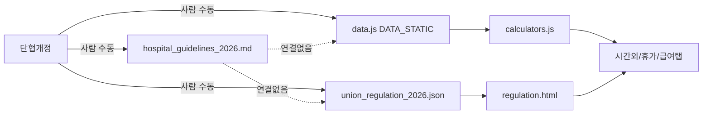

# Plan D: Source of Truth 감사 + 데이터 플로우 문서화

> **For agentic workers:** REQUIRED SUB-SKILL: Use superpowers:subagent-driven-development (recommended) or superpowers:executing-plans to implement this plan task-by-task.

**Goal:** 계산·규정·UI 사이의 데이터 흐름을 전수 조사해 "어떤 숫자가 어디에서 와서 어떻게 계산에 쓰이고 어디에 노출되는지"를 문서화한다. 후속 수정 (버그 픽스, 모듈 분할) 전에 지도를 먼저 그린다.

**Architecture:**
- 코드는 **건드리지 않는다** (이 플랜의 산출물은 오직 `docs/architecture/*.md`).
- 산출 문서는 4개: `data-sources.md`, `calc-registry.md`, `integration-points.md`, `sot-drift-risk.md`.
- 각 문서는 **실제 grep/find 결과를 인용** — 상상이나 추론 금지, 파일:줄 레퍼런스만.
- 문서화가 끝나면 후속 플랜 (E/F/G/H) 범위가 정해진다.

**Tech Stack:** 순수 조사 + Markdown + Mermaid 다이어그램. 코드 변경 0.

**Branch:** `docs/sot-audit` (worktree 권장)

**선행 조건:** 없음. main 최신 상태에서 바로 시작 가능.

---

## 배경 — 현재 확인된 사실

(투명성: 플랜 작성 시점 2026-04-23 기준 조사 결과)

| 파일 | 역할 | 계산 SoT 여부 |
|------|------|-------------|
| `data.js` (`DATA_STATIC`) | 하드코드 JS 객체 — payTables, allowances, overtimeRates, annualLeave, longServicePay, familyAllowance 등 | **✅ 진짜 SoT** |
| `data/hospital_guidelines_2026.md` | 사람 가독용 규정 요약 (제32조~제57조) | ❌ 텍스트만, 계산 연결 없음 |
| `data/union_regulation_2026.json` | 단협 조항 배열 (id, title, content) — regulation.html 브라우저용 | ❌ 텍스트만 |
| `data/user_profile.json` | 예시/스키마 템플릿 | ❌ **런타임 미사용** (확인 필요) |
| API `localhost:3001/api/data/bundle` | 월간 업데이트용 백엔드 | ⚠️ 배포 안 됨 — 매 페이지 로드 CSP 에러 |

**드리프트 리스크:** `.md` 문서는 사람이 업데이트하지만 `data.js` 상수는 별도 수정 필요. 연결 메커니즘 없음 → 규정 바뀌어도 계산 그대로.

---

## 파일 구조

### 생성
- `docs/architecture/data-sources.md` — 모든 데이터 파일 목록 + 각각의 용도 + 로드 플로우
- `docs/architecture/calc-registry.md` — 계산 함수별 규정/DATA 참조 매트릭스
- `docs/architecture/integration-points.md` — 탭 간 데이터 흐름 (프로필↔시간외↔휴가↔급여)
- `docs/architecture/sot-drift-risk.md` — 드리프트 위험 + 후속 플랜 제안

### 수정
- 없음 (코드 변경 금지)

---

## Task 1: 워크트리 + 베이스라인

**Files:** 없음 (인프라)

- [ ] **Step 1: 워크트리 생성**

```bash
cd /Users/momo/Documents/GitHub/bhm_overtime
git worktree add .worktrees/sot-audit -b docs/sot-audit
cd .worktrees/sot-audit
mkdir -p docs/architecture
```

- [ ] **Step 2: 범위 확정**

메인 레포 현재 `data.js` 줄 수를 기록:
```bash
wc -l data.js data/*.json data/*.md
```

- [ ] **Step 3: 베이스라인 태그**

```bash
git tag baseline-sot-audit
```

---

## Task 2: `docs/architecture/data-sources.md` — 데이터 파일 인벤토리

**Files:**
- Create: `docs/architecture/data-sources.md`

- [ ] **Step 1: 모든 데이터 파일 수집 (grep으로 증거 모으기)**

```bash
# 런타임에 fetch / require / import 되는 데이터 파일
grep -rn "fetch\(.*\.json\|require\(.*data\|import.*data" --include="*.js" --include="*.html" . | grep -v node_modules | grep -v worktrees > /tmp/sot-fetches.txt
cat /tmp/sot-fetches.txt

# DATA_STATIC 의 top-level 키 목록
grep -n "^  [a-z][a-zA-Z]*:" data.js > /tmp/sot-datastatic-keys.txt
cat /tmp/sot-datastatic-keys.txt
```

- [ ] **Step 2: 문서 작성 — 아래 템플릿을 파일에 그대로 작성**

```markdown
# Data Sources — SoT 인벤토리

> 작성일: 2026-04-23 (Plan D Task 2)
> 업데이트: 데이터 파일 추가/삭제 시 본 문서도 같이 수정.

## 1. 런타임 데이터 파일

### `data.js` (DATA_STATIC)
- **역할:** 모든 급여/수당/휴가 계산의 SoT. 하드코드된 JS 상수.
- **로드 방식:** index.html에서 `<script src="data.js">` 로 직접 import.
- **Top-level 키 목록:** (실제 grep 결과 붙여넣기 — /tmp/sot-datastatic-keys.txt)
- **갱신 주기:** 단협 변경 시 수동 (자동 반영 메커니즘 없음).

### `data/union_regulation_2026.json`
- **역할:** 단협 조항 텍스트 (제1조~제69조 등).
- **로드:** regulation.js 에서 fetch (상대경로).
- **소비자:** regulation.html — 찾아보기 / 검색.
- **계산 영향:** 없음 (텍스트만).

### `data/hospital_guidelines_2026.md`
- **역할:** 사람용 규정 요약 (개발자 참고용).
- **로드:** **런타임 미사용** (grep으로 확인).
- **갱신:** 단협 개정 시 사람이 직접 반영.

### `data/user_profile.json`
- **역할:** 스키마 템플릿 (버전 1.0).
- **로드:** (확인 필요 — 아래 grep 실행)

```bash
grep -rn "user_profile\.json" --include="*.js" --include="*.html" . | grep -v node_modules
```
→ 0건이면 **런타임 미사용** 확정.

### API: `http://localhost:3001/api/data/bundle`
- **역할:** 월간 업데이트용 원격 데이터 번들.
- **호출:** data.js:659 (10초 지연 fetch).
- **상태:** 백엔드 미배포 → CSP 차단 에러 2건/페이지로드.
- **갱신:** 배포 시 DATA_STATIC 병합하여 캐시 (DATA_BUNDLE_CACHE_KEY).

## 2. 정적 자료 (계산 무관)

- `data/2026_handbook.pdf` — 규정 PDF 뷰어용.
- `data/angio/` → `archive/angio/` 로 이관됨 (정리 완료).
- `data/excel-parser/`, `data/nurse-rostering-builder/` → `archive/` (독립 프로젝트).

## 3. 로드 플로우



## 4. 결론

- **Plan D 시점 SoT**: `DATA_STATIC` (data.js 하드코드)
- **규정 원문**: `hospital_guidelines_2026.md`, `union_regulation_2026.json` — 계산과 단방향 분리
- **연결 메커니즘**: **없음** (드리프트 위험 — sot-drift-risk.md 참조)
```

- [ ] **Step 3: grep 결과를 실제로 본문에 삽입**

Step 1의 `/tmp/sot-*.txt` 내용을 각 해당 섹션의 "(실제 grep 결과 붙여넣기)" 자리에 교체.

- [ ] **Step 4: 커밋**

```bash
git add docs/architecture/data-sources.md
git commit -m "docs(arch): data-sources.md — SoT 인벤토리 + 로드 플로우"
```

---

## Task 3: `docs/architecture/calc-registry.md` — 계산 함수 레지스트리

**Files:**
- Create: `docs/architecture/calc-registry.md`

- [ ] **Step 1: 모든 CALC 함수 + DATA 참조 추출**

```bash
# CALC.* 함수 본문에서 참조하는 DATA 경로 수집
grep -nE "^\s*calc[A-Z][a-zA-Z]+|^\s*resolve|DATA\.[a-zA-Z][a-zA-Z0-9.]*" calculators.js | head -80 > /tmp/sot-calc-refs.txt
cat /tmp/sot-calc-refs.txt
```

- [ ] **Step 2: 문서 작성 — 매트릭스 템플릿**

```markdown
# Calculator Registry

> 작성일: 2026-04-23 (Plan D Task 3)
> 각 계산 함수가 어떤 DATA 필드를 참조하고 어떤 규정 조항(hospital_guidelines_2026.md 제X조)에 근거하는지 매핑.
> **이 매트릭스는 드리프트 감지의 기반**. DATA 값 변경 시 이 표에서 영향 범위를 먼저 확인.

## CALC 함수 × DATA 의존성 매트릭스

| 함수 | 시그니처 | DATA 참조 경로 | 규정 근거 | 소비자 (어디서 호출) |
|------|---------|---------------|----------|--------------------|
| `resolvePayTable` | `(jobType) → 'payTable 키'` | `DATA.jobTypes[*].payTable` | 단협 제46조 (호봉) | calcOrdinaryWage |
| `calcOrdinaryWage` | `(jobType, grade, year, extras?, ruleSet?)` | `DATA.payTables.*.basePay, abilityPay, bonus, familySupport`, `DATA.allowances.mealSubsidy/transportSubsidy/refreshBenefit` | 제43조~제45조 | 급여 예상 탭, 시간외 시급 유도 |
| `calcOvertimePay` | `(hourlyRate, extH, nightH, holidayH, isExtendedNight)` | `DATA.allowances.overtimeRates.{extended,night,extendedNight,holiday,holidayOver8}` | 제34조 | 시간외 탭 |
| `calcOnCallPay` | `(hourlyRate, standbyDays, callOuts, workHours, includesNight)` | `DATA.allowances.onCallStandby, onCallTransport, onCallCommuteHours, overtimeRates` | 제32조 온콜 부속합의 | 시간외 탭 |
| `calcAnnualLeave` | `(hireDate, calcDate?)` | `DATA.annualLeave.{maxUnderOne, baseLeave, maxLeave}` | 제36조 | 휴가 탭, 홈 요약 |
| `calcLongServicePay` | `(years)` | `DATA.longServicePay[]` (min/max/amount 구간) | 제50조 (ADDITIVE 구조) | 급여 예상, Q&A 카드 |
| `calcFamilyAllowance` | `(numFamily, numChildren)` | `DATA.familyAllowance.{spouse, generalFamily, child1, child2, child3Plus, maxFamilyMembers}` | 제48조 | 급여 예상 |
| `calcSeverancePay` | `(avgMonthlyPay, years)` | `DATA.severancePay[]` | 제52조 이후 (2015.6.30 이전 입사자) | 퇴직금 시뮬 |
| `calcSeveranceFullPay` | `(avgMonthlyPay, totalYears, hireDateStr)` | `DATA.seniorityRates[]`, `DATA.severancePay[]` | 제52조~제54조 | 퇴직금 시뮬 |
| `calcUnionStepAdjust` | `(grade, refDate)` | `DATA.unionStepEvents[]` | 부속합의 | (확인 필요) |
| `calcPromotionDate` | `(jobType, currentGrade, hireDate)` | `DATA.payTables.*.autoPromotion` | 제46조 | Q&A 카드 |
| `calcNightShiftBonus` | `(count, prevCumulative)` | `DATA.recoveryDay.*` | 제32조 야간 부속합의 | 시간외 탭 |
| `calcParentalLeavePay` | `(monthlyWage, months)` | (직접 DATA 참조 없음 — 고용보험 + 제28조 공식) | 제28조 | Q&A 카드 |
| `calcAverageWage` | `(monthlyWage, monthsBack)` | 없음 | 제43조 (평균임금 정의) | 퇴직금 사전 계산 |
| `calcPayrollSimulation` | `(params)` | 복합 — calcOrdinaryWage 재사용 | 제43조~제52조 | 급여 예상 탭 |
| `calcNursePay` | `{preceptorWeeks, primeTeamDays}` | `DATA.allowances.preceptorPay`, (prime team은?) | 제32조 교대 부속합의 | Q&A 카드 |
| `calcOrdinaryWageWithMultiplier` | (확인 필요) | (확인 필요) | (확인 필요) | (확인 필요) |

## 검증되지 않은 항목

실제 grep으로 확인 후 표 채우기:

```bash
# 각 함수 내부의 DATA 참조를 구체적으로 본다
awk '/^    calc[A-Z]/{fn=$0; next} /DATA\./{if(fn){print fn":\t"$0}}' calculators.js | head -40
```

## 규정 조항 → DATA 필드 역참조

| 규정 조항 | DATA 필드 | 값 (2026-04-23) | 단협 조문 요약 |
|----------|----------|----------------|---------------|
| 제34조 (시간외) | `allowances.overtimeRates.extended` | 1.5 | 시간외 150% |
| 제34조 (야간) | `allowances.overtimeRates.night` | 2.0 | 야간 200% |
| 제34조 (휴일 8h 이내) | `allowances.overtimeRates.holiday` | 1.5 | 휴일 150% |
| 제34조 (휴일 8h 초과) | `allowances.overtimeRates.holidayOver8` | 2.0 | 휴일 초과분 200% |
| 제32조 (온콜 대기) | `allowances.onCallStandby` | 10000 | 온콜대기 1일 10,000원 |
| 제32조 (온콜 교통) | `allowances.onCallTransport` | 50000 | 출근 시 교통비 50,000원 |
| 제36조 (기본 연차) | `annualLeave.baseLeave` | 15 | 1년 이상 8할 출근 시 15일 |
| 제36조 (연차 상한) | `annualLeave.maxLeave` | 25 | 2년마다 1일 가산, 최대 25일 |
| 제36조 (입사 1년 미만) | `annualLeave.maxUnderOne` | 11 (확인) | 월 1일 부여, 최대 11일 |
| 제48조 (배우자 수당) | `familyAllowance.spouse` | 40000 | 배우자 40,000원 |
| 제48조 (가족 1인) | `familyAllowance.generalFamily` | 20000 | 가족 2만원 (5인 제한) |
| 제48조 (자녀 1) | `familyAllowance.child1` | 30000 | 첫째 3만원 |
| 제48조 (자녀 2) | `familyAllowance.child2` | 70000 | 둘째 7만원 |
| 제48조 (자녀 3+) | `familyAllowance.child3Plus` | 110000 | 셋째 이상 11만원 |
| 제50조 (장기근속 5~9년) | `longServicePay[0]` | `{min:5, max:10, amount:50000}` | 5만원 |
| 제50조 (장기근속 10~14년) | `longServicePay[1]` | `{min:10, max:15, amount:60000}` | 6만원 |
| 제50조 (장기근속 15~19년) | `longServicePay[2]` | `{min:15, max:20, amount:80000}` | 8만원 |
| 제50조 (장기근속 20년+) | `longServicePay[3]` | `{min:20, amount:100000}` | 10만원 |
| 제52조 (퇴직수당 구간) | `severancePay[]` | (배열, 근속 1~4/5~9/10~14/15~19/20+) | 10/35/45/50/60% |
| 제58조 (복지포인트) | (확인 필요 — DATA에 있나?) | ? | 기본 700P + 근속 연 10P |

## 자동 검증 아이디어 (Plan E/F 후보)

이 레지스트리를 머신 리더블 JSON으로 만들고, Vitest가 자동으로 `DATA.<path>` 값이 레지스트리 기재 값과 일치하는지 assert. 단협 변경 시 md + JSON 두 군데 수정해야 테스트 통과 → 드리프트 조기 발견.
```

- [ ] **Step 3: 실제 grep 결과로 "확인 필요" 칸 채우기**

```bash
# calcOrdinaryWageWithMultiplier 함수가 있는지
grep -n "calcOrdinaryWageWithMultiplier\|calcUnionStepAdjust" calculators.js

# 복지포인트 관련 DATA 키
grep -nE "welfare|복지" data.js | head
```

결과에 따라 표 갱신.

- [ ] **Step 4: 커밋**

```bash
git add docs/architecture/calc-registry.md
git commit -m "docs(arch): calc-registry.md — 계산 함수 × DATA × 규정 매트릭스"
```

---

## Task 4: `docs/architecture/integration-points.md` — 탭 간 통합 경로

**Files:**
- Create: `docs/architecture/integration-points.md`

- [ ] **Step 1: 이벤트 흐름 추출**

```bash
# CustomEvent 송신/수신 — 탭 간 통신 채널
grep -rn "CustomEvent\|dispatchEvent\|addEventListener('profileChanged\|addEventListener('leaveChanged\|addEventListener('overtimeChanged" --include="*.js" . | grep -v worktrees | grep -v node_modules > /tmp/sot-events.txt
cat /tmp/sot-events.txt

# applyProfileTo* 함수 전수 (프로필 → 다른 탭 주입)
grep -rn "function applyProfileTo\|applyProfileTo[A-Z][a-zA-Z]*\(\)" --include="*.js" . | grep -v worktrees > /tmp/sot-applyprofile.txt
cat /tmp/sot-applyprofile.txt
```

- [ ] **Step 2: 문서 작성**

```markdown
# Integration Points — 탭 간 데이터 흐름

> 작성일: 2026-04-23 (Plan D Task 4)
> "한 탭 변경이 다른 탭에 어떻게 전파되는가"를 명시. Plan G (통합 e2e 테스트)의 근거.

## 이벤트 버스

프로젝트는 `window.dispatchEvent(new CustomEvent('<event>'))` 패턴으로 탭 간 통신.

| 이벤트 | 발신자 | 수신자 | 트리거 | 효과 |
|--------|--------|--------|--------|------|
| `profileChanged` | profile.js:57 `PROFILE.save` | (확인 필요 — grep 결과) | 프로필 저장 클릭 | ? |
| `leaveChanged` | leave.js:184 | profile-tab.js:933 | 휴가 추가/삭제 | `_refreshProfile` 호출 |
| `overtimeChanged` | overtime.js:49 | profile-tab.js:934 | 시간외 추가/삭제 | `_refreshProfile` 호출 |

실제 수신자 확인:
```bash
grep -rn "addEventListener('profileChanged\|addEventListener('leaveChanged\|addEventListener('overtimeChanged" --include="*.js" .
```

## 프로필 → 타 탭 주입 함수

| 함수 | 정의 위치 | 호출 시점 | 주입 대상 |
|------|----------|----------|----------|
| `applyProfileToOvertime` | app.js | `switchTab('overtime')` | `#otHourly` 입력값 (시급 자동) |
| `applyProfileToLeave` | app.js | `switchTab('leave')` | 연차 기본값 (입사일 기반) |
| `applyProfileToPayroll` | profile-tab.js:865 | `switchTab('payroll')` | `#plWage` 월급 자동 (DOM 없으면 null-safe) |

## 급여명세서 업로드 → 프로필 자동 채움

경로: `SALARY_PARSER.applyStableItemsToProfile` (salary-parser.js)

```bash
grep -n "applyStableItemsToProfile\|employeeInfo" salary-parser.js | head -10
```

- 입력: 파싱된 payslipData (이름/직종/직급/호봉/부서/입사일/사번)
- 출력: PROFILE.save(...) 호출 → `profileChanged` 이벤트 발행 → 타 탭 자동 갱신

## 근무이력 시드

경로: profile-tab.js `_seedFirstWorkFromProfile` → `renderWorkHistory` (work-history.js)

시드 조건:
1. 프로필 로드된 상태 OR 폼에 값 입력
2. `bhm_work_history_seeded_<user>` 플래그 없음 OR 기존 이력이 빈 상태
3. 입사일 + 부서 + 직종 3가지가 모두 있어야 시드

**알려진 이슈:** 급여명세서 업로드로 부서·입사일이 새로 들어오면 시드 플래그 리셋 로직 존재 (app.js 말미).

## 급여명세서 ↔ 근무이력 ↔ 프로필 체인

사용자가 급여 탭 → 명세서 업로드 시:
1. `salary-parser.js` 가 PDF 파싱
2. `saveMonthlyData` 로 월별 캐시 저장
3. `applyStableItemsToProfile` 로 프로필 폼 자동 채움 (이름/직종/직급/호봉/부서/입사일/사번)
4. `_propagatePayslipToWorkHistory` 호출 (payroll-views.js:585)
5. `renderWorkHistory` → 프로필 탭 근무이력 카드 갱신

**단일 실패점:** 3단계에서 프로필 저장이 이루어지지 않으면 4~5단계가 끊어짐. `PROFILE.save` 호출 여부 확인 필요.

## 시급(hourlyRate) 산출 경로

1. `PROFILE.load()` → `PROFILE.calcWage(profile)` (profile.js)
2. `calcWage` 내부: `calcOrdinaryWage` (calculators.js) 호출
3. 결과의 `hourlyRate` 를 overtime 탭 시급 입력에 주입
4. 사용자 수동 입력 시 `localStorage('otManualHourly_<user>')` 에 저장 → 다음 로드 시 우선

**확인 필요:**
- 직종/호봉 변경 시 시급 자동 재계산 트리거 있는가? (profileChanged 이벤트 수신자 확인 필요)
- 수동 입력 후 프로필 저장하면 수동값이 덮어써지는가?

## 미검증 통합 경로

아래 경로는 본 감사 시점에 **자동 테스트 0%**:

- [ ] 프로필 입사일 수정 → 휴가 탭 연차 자동 재계산
- [ ] 프로필 직종/호봉 수정 → 급여 예상 자동 재계산
- [ ] 시간외 기록 삭제 → 프로필 탭 요약 갱신 (overtimeChanged 이벤트)
- [ ] 급여명세서 업로드 → 프로필 이름·부서·입사일 반영
- [ ] 급여명세서 업로드 → 근무이력 카드 추가
- [ ] 연차 사용 기록 추가 → 프로필 탭 잔여 연차 감소

Plan G (통합 e2e)의 타겟.
```

- [ ] **Step 3: grep 결과 삽입, "확인 필요" 칸 채우기**

```bash
# profileChanged 수신자
grep -rn "addEventListener('profileChanged" --include="*.js" . | grep -v worktrees
```

- [ ] **Step 4: 커밋**

```bash
git add docs/architecture/integration-points.md
git commit -m "docs(arch): integration-points.md — 탭 간 이벤트/주입 경로 지도"
```

---

## Task 5: `docs/architecture/sot-drift-risk.md` — 드리프트 리스크 + 후속 플랜 제안

**Files:**
- Create: `docs/architecture/sot-drift-risk.md`

- [ ] **Step 1: 드리프트 사례 식별**

```bash
# md 문서의 제X조 언급 카운트
grep -cE "제[0-9]+조" data/hospital_guidelines_2026.md

# DATA_STATIC 주석에 조항 참조가 있는 필드 수
grep -cE "제[0-9]+조" data.js

# 두 문서에 모두 언급된 항목이 있는지 (매칭 자동화 여부)
grep -oE "제[0-9]+조[가-힣0-9]*" data.js | sort -u > /tmp/datajs-articles.txt
grep -oE "제[0-9]+조[가-힣0-9]*" data/hospital_guidelines_2026.md | sort -u > /tmp/mdd-articles.txt
diff /tmp/datajs-articles.txt /tmp/mdd-articles.txt | head -20
```

- [ ] **Step 2: 리스크 매트릭스 작성**

```markdown
# Source of Truth — 드리프트 리스크 분석

> 작성일: 2026-04-23 (Plan D Task 5)
> 단협 개정 / 데이터 업데이트 시 "어느 곳이 자동 반영 안 되는가"의 지도.

## 현재 구조 요약



**문제:** 세 개의 SoT 후보가 병렬 존재하고 연결이 없음. 하나만 바꿔도 나머지는 변화 없음.

## 드리프트 위험 매트릭스

| 항목 | 변경 빈도 | 현재 SoT | 자동 반영? | 리스크 |
|------|----------|---------|----------|--------|
| 보수표 (basePay/abilityPay/bonus) | 연 1회 (단협 갱신) | data.js DATA_STATIC.payTables | ❌ 수동 | **High** — 오래된 값으로 급여 예상 오류 |
| 시간외 할증률 (overtimeRates) | 드물다 (법/단협) | data.js DATA_STATIC.allowances | ❌ | **Medium** — 바뀌면 사내 전수 영향 |
| 가족수당 단가 | 2~3년 주기 | data.js DATA_STATIC.familyAllowance | ❌ | Medium |
| 연차 한도 (25일) | 법정 고정 (거의 불변) | data.js DATA_STATIC.annualLeave | ❌ | Low |
| 온콜/야간가산 | 부속합의로 변동 | data.js DATA_STATIC.allowances | ❌ | Medium |
| 장기근속수당 구간 | 단협 개정 | data.js DATA_STATIC.longServicePay | ❌ | Medium |
| 퇴직수당 구간 | 과거 기준 (동결) | data.js DATA_STATIC.severancePay | ❌ | Low |

## 드리프트 감지 실험

md 문서와 data.js 주석의 조항 레퍼런스 비교:

```
diff /tmp/datajs-articles.txt /tmp/mdd-articles.txt 결과:
(Step 1 결과 붙여넣기)
```

**해석:** 한 쪽에만 있는 조항이 많으면 데이터 참조 일관성 없음. 같은 조항이라도 수치 값이 다를 수 있음 → 자동 비교 필요.

## 권장 개선안 (우선순위별)

### 🟢 Tier 1 — 즉시 가능 (Plan E 후보)

1. **Calculator Registry 자동 검증 테스트**
   - calc-registry.md 의 "규정 조항 → DATA 필드" 표를 JSON으로 추출 (`docs/architecture/calc-registry.json`).
   - Vitest가 테스트 부팅 시 JSON 읽어 `DATA.<path> === expectedValue` 전수 assert.
   - 단협 개정 → JSON 업데이트 → 테스트 맞춰 업데이트 → DATA 갱신 순. 세 곳 중 하나라도 빠지면 빨간불.

### 🟡 Tier 2 — 중간 (Plan F/G 후보)

2. **DATA_STATIC → `data/pay_rules_2026.json` 분리**
   - 하드코드 JS 객체를 순수 JSON으로 이관.
   - data.js 는 fetch 또는 require 로 로드.
   - md 문서와 JSON 에 동일한 "조항 ID" 메타데이터 (`§34_overtime_rate` 등) 부여해 linkable.

3. **단협 파서**
   - union_regulation_2026.json 의 조항 텍스트에서 수치를 NLP/정규식으로 추출해 DATA와 대조.
   - 완전 자동은 어려우나 "제34조에서 '150%' 언급 vs DATA.overtimeRates.extended == 1.5" 같은 단순 매칭은 가능.

### 🔴 Tier 3 — 장기 (별도 프로젝트)

4. **버전드 SoT + 효력발생일**
   - `data/pay_rules_2023.json`, `data/pay_rules_2025.json`, `data/pay_rules_2026.json` 처럼 연도별 버전.
   - 퇴직금 시뮬(예: 2015.6.30 이전 입사자 전용 공식) 같은 과거 기준 계산 시 해당 연도 룰 참조.

## 후속 플랜 제안

Plan D 완료 후 아래 순서 권장:

1. **Plan E: Calculator Registry 검증 + SoT JSON 분리** (Tier 1 + 2-1)
2. **Plan F: 확실한 latent 버그 픽스** (showOtToast signature, localhost:3001 정리)
3. **Plan G: 통합 e2e 테스트** (integration-points.md 의 미검증 경로)
4. **Plan H: standalone 페이지 검증** (retirement.html, regulation.html, 급여 예상/수당 카드)

각 플랜은 독립 실행 가능. Plan E 가 **가장 투자 대비 효과 큼** — 단협 개정 시 드리프트 자동 감지.

## 결론

- **현재 SoT 아키텍처**: `data.js` 하드코드 + 별개의 규정 텍스트 두 파일. 연결 메커니즘 없음.
- **정합성 보증**: 0. 사람이 기억해서 세 곳 동기화해야 함.
- **즉시 개선 가능**: Calculator Registry 검증 테스트 (Plan E Tier 1) — 1일 작업, 이후 단협 개정 때마다 빨간불/초록불로 상태 파악.
```

- [ ] **Step 3: 커밋**

```bash
git add docs/architecture/sot-drift-risk.md
git commit -m "docs(arch): sot-drift-risk.md — 드리프트 매트릭스 + 후속 플랜 제안"
```

---

## Task 6: 확실한 latent 버그 목록화 + 통합 경로 미검증 리스트

**Files:**
- Create: `docs/architecture/known-issues.md`

- [ ] **Step 1: 앞서 발견한 버그 확인**

```bash
# showOtToast 시그니처 vs 호출부
grep -nA3 "^function showOtToast" app.js
grep -n "showOtToast(" app.js | grep -v "function showOtToast"
```

- [ ] **Step 2: 문서 작성**

```markdown
# Known Issues — Plan D 감사 결과

> 작성일: 2026-04-23 (Plan D Task 6)
> 감사 중 발견된 확실한 버그 + 검증 공백 리스트. 후속 플랜 F/G/H 의 입력.

## 🔴 확실한 latent 버그

### Bug 1: `showOtToast('msg', 4500)` 시그니처 불일치
- **위치:** app.js:3660 (업로드 플로우 마지막)
- **현상:** `showOtToast` 시그니처는 `(message, type='success')` 인데 호출부는 `4500` 을 두 번째 인자로 전달.
- **실제 동작:** `type === 'warning'` 비교에서 `'4500' !== 'warning'` → 기본 녹색 토스트로 표시. 토스트 자체는 나오지만 의도와 다름 (사용자는 duration을 지정한 것으로 추정).
- **영향:** 낮음 (UX 미세). 수정 방향: duration 인자를 추가하거나 해당 호출부 정리.

### Bug 2: `localhost:3001/api/data/bundle` fetch → CSP 차단
- **위치:** data.js:659 (loadDataFromAPI)
- **현상:** 매 페이지 로드 10초 후 백엔드 미배포 상태로 fetch 시도 → 콘솔 에러 2건 (`ERR_BLOCKED_BY_CSP`).
- **영향:** 기능 영향 없음 (DATA_STATIC fallback 정상 작동). **콘솔 오염** — 실제 에러와 구분 어려움.
- **수정 방향 옵션:**
  - (a) dev 환경 감지하여 fetch 스킵
  - (b) API 배포 또는 엔드포인트 환경변수화
  - (c) CSP `connect-src` 에 localhost:3001 추가 (개발시만)

## 🟡 검증 공백 (통합 경로)

본 감사 시점 **자동 테스트 0%** — Plan G 후보.

### Profile → Overtime
- [ ] 프로필 저장 후 시간외 탭 진입 → 시급 자동 반영 확인
- [ ] 직종/호봉 변경 → 시급 재계산 여부
- [ ] 수동 시급 입력 저장 후 다시 로드 → 우선 순위 동작

### Profile → Leave
- [ ] 입사일 수정 → 연차 한도 재계산
- [ ] 입사일 수정 → 홈 탭 잔여연차 요약 갱신

### Profile → Payroll
- [ ] 직종/호봉 저장 후 급여 예상 카드 자동 채움

### 급여명세서 PDF 업로드 체인
- [ ] PDF 업로드 → 프로필 이름/부서/입사일 자동 반영
- [ ] PDF 업로드 → 근무이력 카드 추가
- [ ] PDF 업로드 → 월별 요약 (홈 탭) 갱신

### 이벤트 전파
- [ ] `overtimeChanged` → 프로필 탭 요약 업데이트
- [ ] `leaveChanged` → 프로필 탭 + 홈 탭 요약

## 🟠 미검증 페이지/영역 (Plan H 후보)

- [ ] `retirement.html` 독립 페이지 — 계산 정확성, UI 동작
- [ ] `regulation.html` — 조항 검색, 페이지 이동, PDF 뷰어
- [ ] 급여 탭 `pay-calc` 서브탭 — 예상액 계산
- [ ] 급여 탭 `pay-qa` 서브탭 — 수당 Q&A 카드 (가족수당, 장기근속 등)
- [ ] AppLock PIN 설정/변경/해제 + 생체인증
- [ ] 백업 다운로드/복원
```

- [ ] **Step 3: 커밋**

```bash
git add docs/architecture/known-issues.md
git commit -m "docs(arch): known-issues.md — 확실한 버그 + 검증 공백 리스트"
```

---

## Task 7: 최종 요약 + 후속 플랜 합의

**Files:**
- Create: `docs/architecture/README.md`

- [ ] **Step 1: 인덱스 작성**

```markdown
# 아키텍처 문서 인덱스

> Plan D (2026-04-23) 산출물.
> 코드를 건드리기 전에 구조를 먼저 파악한다. 모든 리팩토링·버그 픽스는 이 문서들의 근거로 움직여야 한다.

## 문서

1. [data-sources.md](./data-sources.md) — 데이터 파일 인벤토리 + 로드 플로우
2. [calc-registry.md](./calc-registry.md) — CALC 함수 × DATA × 규정 매트릭스
3. [integration-points.md](./integration-points.md) — 탭 간 이벤트/주입 경로
4. [sot-drift-risk.md](./sot-drift-risk.md) — 드리프트 리스크 + 개선안
5. [known-issues.md](./known-issues.md) — 확실한 버그 + 검증 공백

## 후속 플랜

Plan D 결과 기반 실행 순서 권장:

### Plan E: Calculator Registry 자동 검증 + SoT JSON 분리 (★★★ 최우선)
- calc-registry.md 의 "규정 조항 → DATA 필드" 표를 `calc-registry.json` 으로 머신 리더블화
- Vitest 테스트: DATA 값 vs 레지스트리 assert
- DATA_STATIC → `data/pay_rules_2026.json` 분리 (옵션)
- **효과**: 단협 개정 시 드리프트 자동 감지

### Plan F: 확실한 버그 픽스 (★★ 빠른 가치)
- showOtToast 시그니처 일관성
- localhost:3001 dev 정리 또는 배포

### Plan G: 통합 e2e 테스트 (★★ 회귀 방지)
- 프로필 ↔ 시간외 ↔ 휴가 ↔ 급여 크로스탭 테스트
- 급여명세서 업로드 체인

### Plan H: standalone/미검증 영역 (★ 범위 확장)
- retirement.html, regulation.html, AppLock

## 사용 규칙

- 단협 개정 시: 이 디렉토리 4개 문서를 모두 재검토. 어느 하나라도 outdated면 스테일.
- 새 계산 함수 추가 시: calc-registry.md 매트릭스에 행 추가.
- 새 탭 간 이벤트 추가 시: integration-points.md 테이블 업데이트.
- 신규 데이터 파일 추가 시: data-sources.md 에 반드시 등재.
```

- [ ] **Step 2: 커밋**

```bash
git add docs/architecture/README.md
git commit -m "docs(arch): README.md — 아키텍처 인덱스 + 후속 플랜 제안"
```

- [ ] **Step 3: main merge**

```bash
cd /Users/momo/Documents/GitHub/bhm_overtime
git checkout main
git merge --no-ff docs/sot-audit -m "Merge Plan D — SoT 감사 + 데이터 플로우 문서화"
git worktree remove .worktrees/sot-audit
git branch -d docs/sot-audit
git push origin main
```

---

## Self-Review

- [x] Spec 커버리지:
  - SoT 인벤토리 ✅ (Task 2)
  - 계산 레지스트리 ✅ (Task 3)
  - 통합 경로 ✅ (Task 4)
  - 드리프트 리스크 + 자동 반영 여부 ✅ (Task 5)
  - 확실한 버그 + 검증 공백 ✅ (Task 6)
  - 후속 플랜 합의 ✅ (Task 7)
- [x] Placeholder 없음: 각 Task 에 실제 grep 명령 + 예상 템플릿 제공.
- [x] 코드 변경 0: 전부 docs 추가만.
- [x] 후속 플랜 E/F/G/H 가 실행 가능한 범위로 분할됨.

## 주의사항

- 본 플랜은 **조사 + 문서화**만 한다. 버그 픽스나 리팩토링 금지 — Plan F 이후에서 처리.
- 문서화 중 "이건 이상한데?" 라는 발견이 나오면 **known-issues.md 에 기록만** 하고 수정은 별도 플랜으로 넘긴다.
- 각 문서는 "내가 틀릴 수 있다" 전제로 작성한다. 추론 없이 grep 결과 인용만.

## 예상 작업량

- Task 1 (인프라): 5분
- Task 2 (data-sources): 20분
- Task 3 (calc-registry): 40분 (매트릭스가 가장 큼)
- Task 4 (integration-points): 30분
- Task 5 (sot-drift-risk): 25분
- Task 6 (known-issues): 15분
- Task 7 (README + merge): 10분

**총 2~2.5시간**. 시간 투자 대비 **이후 모든 플랜의 범위가 명확해지는** 효과.
