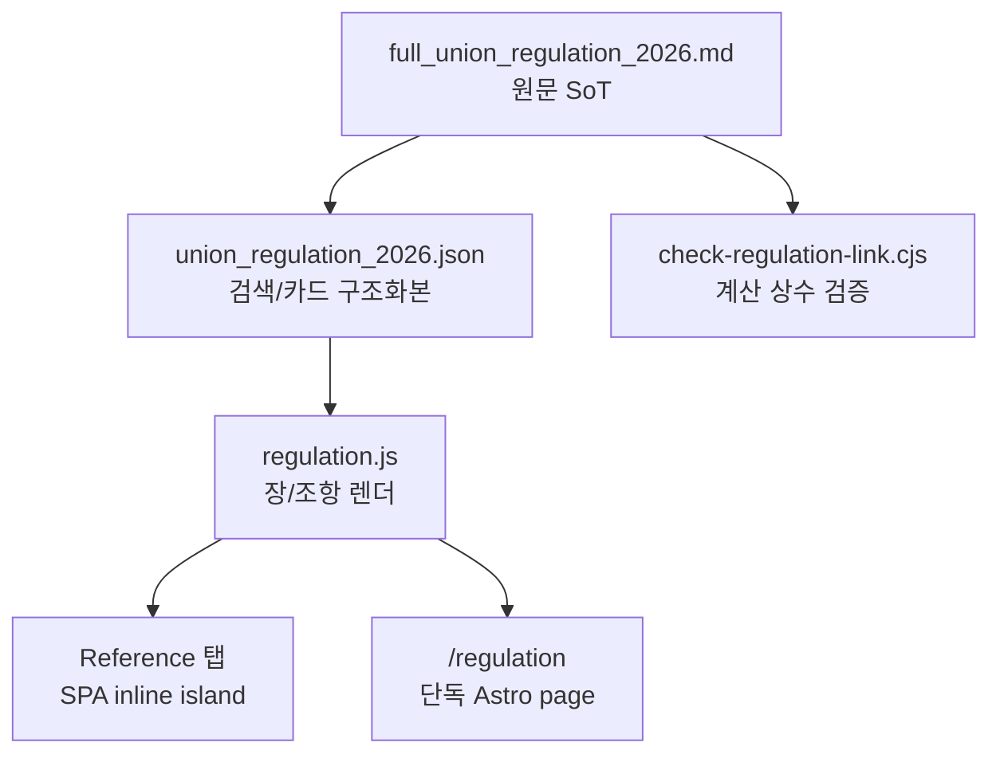

# Regulation Full Source Plan

## 현재 확인

- 전체 원문 MD: `apps/web/public/data/full_union_regulation_2026.md` 및 `public/data/full_union_regulation_2026.md`
- 구조화 JSON: `apps/web/public/data/union_regulation_2026.json` 및 `public/data/union_regulation_2026.json`
- 현재 JSON은 12개 장, 68개 항목을 담고 있다. MD 원문은 3,155줄이며 기존 감사 문서 기준 약 95개 조항 범위다.
- 끊긴 지점은 UI였다. `regulation.js`가 JSON을 읽은 뒤 일부 장을 숨겨서, `전체` 탭이 실제 전체 단체협약이 아니었다.

## 연결 흐름

## 오늘 반영

- `regulation.js`의 기본 숨김 장을 제거해 JSON에 들어온 모든 장이 목차와 `전체`에 표시되도록 한다.
- `ReferenceIsland.astro`와 `/regulation` 단독 페이지에 원문 번호 유지 안내를 동일하게 복구한다.
- 숨김 정책은 `regulation-filter.js`로 분리해, 나중에 “업무 중심 보기”가 필요할 때 원문 전체 보기와 섞이지 않게 한다.

## 다음 계획

1. MD 원문에서 `제N조`, `제N조의M`, `별도 합의사항`, `별첨` 섹션을 추출하는 변환 스크립트를 추가한다.
2. 변환 결과와 기존 `union_regulation_2026.json`을 대조해 누락 조항 목록을 자동 생성한다.
3. UI를 `전체 원문`, `업무 계산`, `별첨/합의` 보기로 나누되, 기본 `전체`는 항상 원문 범위 전체를 보여준다.
4. `check:regulation`에 MD-to-JSON coverage gate를 추가해 68/95 같은 부분 구조화 상태가 조용히 배포되지 않게 한다.
